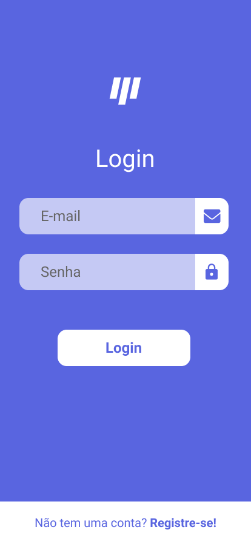

<h1 align="center">  MoveIt - NLW#4 </h1>

<p align="center">
 <a href="#-sobre-o-projeto">Sobre</a> •
 <a href="#-funcionalidades">Funcionalidades</a> •
 <a href="#-layout">Layout</a> • 
 <a href="#-como-executar-o-projeto">Como executar</a> • 
 <a href="#-tecnologias">Tecnologias</a> • 
 <a href="#-autora">Autora</a> 
</p>

## 💻 Sobre o projeto

MoveIt foi criado com o intuito de ajudar pessoas que passam muito tempo em frente ao computador a realizar uma pausa e fazer uma atividade durante um determinado período.
A cada atividade concluída o usuário recebe um XP e assim vai aumentando de nível ao atingir a meta máxima.

O MoveIt foi um projeto desenvolvido na NLW#4 realizado pela Rocketseat e ministrada pelo CTO Diego Fernandes. O NLW é uma experiência online com muito conteúdo prático, desafios e hacks onde o conteúdo fica disponível durante uma semana.

O projeto inicial foi inteiramente voltado para web, porém afim de aprofundar as minhas habilidades criei a versão mobile do MoveIt.

## ⚙️ Funcionalidades

- [x] Experience Percent
- [x] Profile
- [x] Completed Challenge
- [x] Countdown
  - [x] Iniciar ciclo
  - [x] Abandonar ciclo
  - [x] Finalizar ciclo
- [x] Definir desafios
- [x] Falhar no desafio
  - [x] Encerrar desafio
  - [x] Resetar tempo
- [x] Completar desafio
  - [x] Aumentar XP
  - [x] Resetar tempo
  - [x] Passar para o próximo desafio
- [x] Passar de level após completar a barra de XP
- [x] Exibir modal quando avançar de nível
- [x] Registrar novo usuário
- [x] Alterar dados da conta
  - [x] Alterar dados pessoais (Nome e Sobrenome)
  - [x] Alterar dados de acesso (E-mail e senha)
- [x] Resetar dados acumulados dos desafios concluídos
- [x] Excluir conta de usuário

## 🎨 Layout

O layout da aplicação está disponível no Figma e foi feito por Nayara Corrêa baseado no layout feito pelo Tiago Luchtenberg para a NLW#4:

<a href="https://www.figma.com/file/G2xbaHFo1a5CUMXAdCNM72/MoveIt-Mobile?node-id=0%3A1">
  
</a>

Layout NLW#4:

<a href="https://www.figma.com/file/ge20pu3ofMOKoliUyKx1Nl/?viewer=1&node-id=160:2761">
  
</a>

### Web

<p align="center" style="display: flex; align-items: flex-start; justify-content: center;">
  

  

</p>

## 🚀 Como executar o projeto

### Pré-requisitos

Antes de começar, você vai precisar ter instalado em sua máquina as seguintes ferramentas:
[Git](https://git-scm.com), [Node.js](https://nodejs.org/en/).
Além disto é bom ter um editor para trabalhar com o código como [VSCode](https://code.visualstudio.com/)

#### 🧭 Rodando a aplicação web (Frontend)

```bash

# Clone este repositório
$ git clone git@github.com:nayaracorrea/moveit-mobile.git

# No seu terminal/cmd instale o Expo CLI
$ npm install --global expo-cli

# Acesse a pasta do projeto no seu terminal/cmd
$ cd moveit-mobile

# Vá para a pasta da aplicação
$ cd moveit-mobile

# Instale as dependências
$ npm install ou yarn install

# Inicie o Expo
$ expo start --android ou expo start --ios

# Obs.: Se for executar a aplicação no Android lembre-se de ter um emulador em execução antes de iniciar o expo

# Obs.2: A aplicação pode ser executada diretamente no seu smartphone.
# Para isso você precisa ter instalado no seu dispositivo o aplicativo do Expo e scannear o QR Code que aparece no canto inferior esquerdo da página que irá abrir após rodar o comando expo start.


```

## 🛠 Tecnologias

As seguintes ferramentes foram usadas na construção do projeto:

### **Aplicativo** ([TypeScript](https://www.typescriptlang.org/))

- **[React Native](https://reactnative.dev/)**
- **[Expo](https://docs.expo.io/)**
- **[Async Storage](https://reactnative.dev/docs/asyncstorage)**
- **[Formik](https://formik.org/)**
- **[Yup](https://github.com/jquense/yup)**
- **[Styled-Component](https://styled-components.com/)**

> Veja o arquivo [package.json](https://github.com/nayaracorrea/moveit-mobile/blob/master/package.json)

## 💪 Como contribuir para o projeto

1. Faça um **fork** do projeto.
2. Crie uma nova branch com as suas alterações: `git checkout -b my-feature`
3. Salve as alterações e crie uma mensagem de commit contando o que você fez: `git commit -m "feature: My new feature"`
4. Envie as suas alterações: `git push origin my-feature`

## 🙋 Autora

<a href="https://app.rocketseat.com.br/me/nayaraflorentino-1602180404901">
 
 <br />
 <sub><b>Nayara Corrêa</b></sub></a> <a href="https://app.rocketseat.com.br/me/nayaraflorentino-1602180404901" title="Rocketseat">🚀
 </a>

Feito por Nayara Corrêa 👋🏽 Entre em contato!

[](https://www.linkedin.com/in/nayaracorreaflorentino/)
[](mailto:nayara.florentino@gmail.com)
